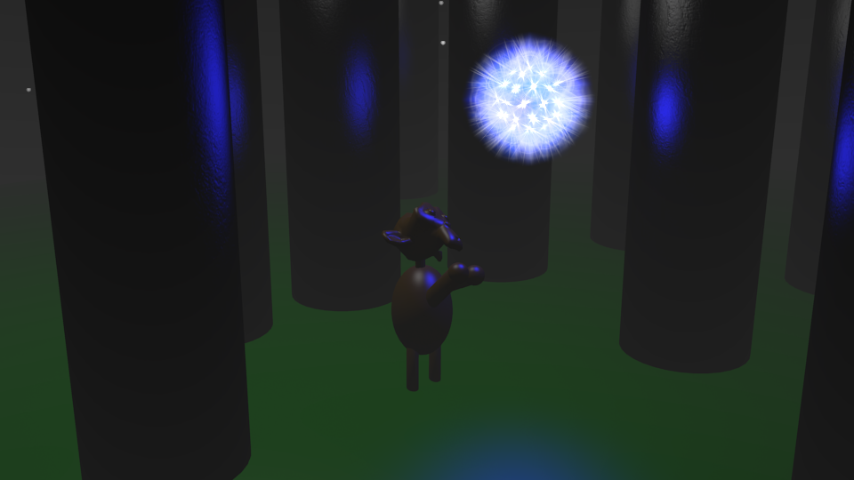
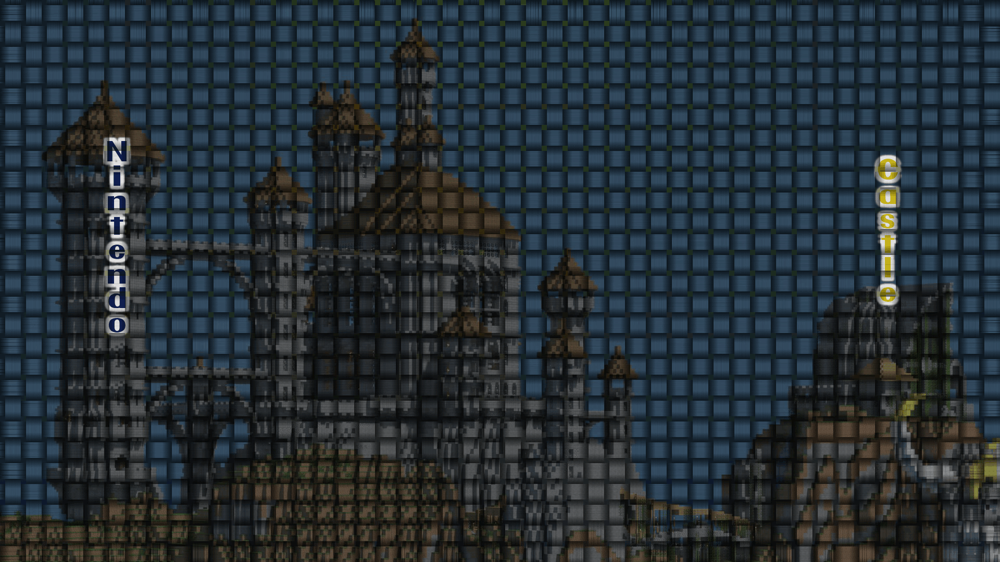

## Blender

### Fairy Forest

Inspired by The Legend of Zelda: Ocarina of Time, a monkey finds a fairy in this foggy forest.

### Light House

<iframe src="http://www.schooltube.com/embed_force/5617d6c7a4604b099ea8/" width="500" height="375" frameborder="0" allowfullscreen="allowfullscreen"></iframe>
Using textures and light direction to create a lighthouse near the sea.

### 360 Checkered Cube Test

<iframe src="http://www.schooltube.com/embed_force/afec8b6d4a4348bd9602/" width="500" height="375" frameborder="0" allowfullscreen="allowfullscreen"></iframe>
Camera movement.

### Meteor Shower

<iframe src="http://www.schooltube.com/embed_force/46a9fe92331c41a28626/" width="500" height="375" frameborder="0" allowfullscreen="allowfullscreen"></iframe>
Velocity test with falling spheres.

### Flag Pole

<iframe src="http://www.schooltube.com/embed_force/368f928174e04875b788/" width="500" height="375" frameborder="0" allowfullscreen="allowfullscreen"></iframe>
Wind test and image mapping.

### Domin-oh-no's

<iframe src="http://www.schooltube.com/embed_force/54aa04cc08524a5b95fd/" width="500" height="375" frameborder="0" allowfullscreen="allowfullscreen"></iframe>
Using gravity and weight to create a unique domino movement.

### Roboscape

<iframe src="http://www.schooltube.com/embed_force/bad25c36cf774cb1a82e/" width="500" height="375" frameborder="0" allowfullscreen="allowfullscreen"></iframe>
Roboscape is an animated short created for the 2012 PA High School Computer Fair, of which we placed Third in the Animation category. Our robot was themed off of the Android robot with original music composed by myself. Sound effects (that can be heard) created and performed by Christopher R. Akers.

## Nintendo Castle 4.0

All images made using GIMP Studio.

### Background

### Headers

### Menu Sprites

## Miscellaneous

### [Hickory Dickory Docks](../assets/ryan_hammett_HDD.swf) (Flash Animation)
